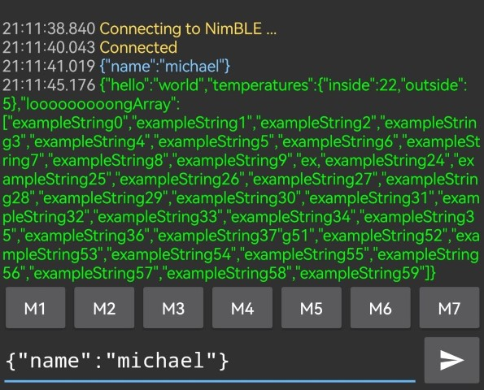
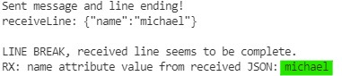

# Make the ESP32 act like a HM-10 module
## Motivation

There are many tools and apps like the [Serial Bluetooth Terminal](https://play.google.com/store/apps/details?id=de.kai_morich.serial_bluetooth_terminal) to communicate with the HM-10. And so, it's quite simple to communicate with it and a connected Arduino. Because of this, you find many examples using the HM-10 to send data to an Arduino via bluetooth. 

Except from this, I use the HM-10 (connected to a custom Android app) in a personal project and due to problems with it's UART connection to an Arduino nano, I want to replace it by an ESP32. The ESP32 has the BLE built-in and many more features I can make use of in my project...

## Goal
Make the ESP32 act like a HM-10 module. At least similar: I want to send similar data (JSON) and process the data directly on the ESP32 (instead of redirecting it to UART, like the HM-10).

## HM-10 Module
So what is needed to act like the HM-10 and how does the mentioned App knows the correct UUID's? Actually, it's quiet simple, the App expects exactly some pre-defined, fixed UUID's. (In the "Serial Bluetooth Terminal" App, in the settings of a BLE device, you can see the predefined UUID's, or set them custom)

### GATT Services
The HM-10 offers a GATT Service with fixed service- and characteristics UUID's and every transmitted or received message it gets from or to it's UART port will be transmitted via bluetooth. So it enables a simple *Phone <-> HM-10 <-> UART <-> Arduino* connection.
The service contains a "characteristic" wich is used to "read and write" to UART of the HM-10.

If I want the same behavior with the ESP32, the UUID's of the service and characteristic need to be the same. They are not that default that you find it clearly and explained like this. The origin of them simply seems to be the ones, that the manufacturer set as first. I paste it here, of course they are the same as in the code example:

### UUID's HM-10
- SERVICE_UUID: `0000ffe0-0000-1000-8000-00805f9b34fb`
- CHARACTERISTIC_RX_TX_UUID: `0000ffe1-0000-1000-8000-00805f9b34fb`

## Example with JSON
Acutally, a GATT services contains many characteristics and they are designed to only hold one value each. There are standards like for battery-state or heartbeat.
I observed that many devices use it different: A long string is sent by splitting the string in many parts and using the notify-feature of BLE to make the receiver get the current part, then it goes on to the next part and notifies again... The string mostly is  formatted data and devided in any way you can think of. Often CSV. The big advantage is: You can send much more data and you can extend it by updates.

So, I need to transmit a lot of values and I want to format them as JSON. JSON is a widly used standard you find enough libraries in any language - and it's very extensible.

As result you can send and receive JSON-formatted messages from/to the ESP32. Every message has to end by a linebreak `\n`. Important if you test it: You need the pairing pin: '123456'. The example print's out the attribute `name` in a JSON if it receives it. 

Example: send `{"name":"peter"}` to the ESP and watch the debug serial monitor of the ESP.

The ESP will send a large test-JSON every few seconds to the connected client.

## Examples from NimBLE-Arduino

The example is inspired by the examples of the [NimBLE-Arduino project](https://github.com/h2zero/NimBLE-Arduino), *NimBLE_Server.ino* and *NimBLE_Secure_Server.ino* file.

And I use the *ArduinoJSON* library.

## Screenshots
Serial Bluetooth Terminal App:

Serial Terminal in PlatformIO:

(*created 2022-05, MP*)